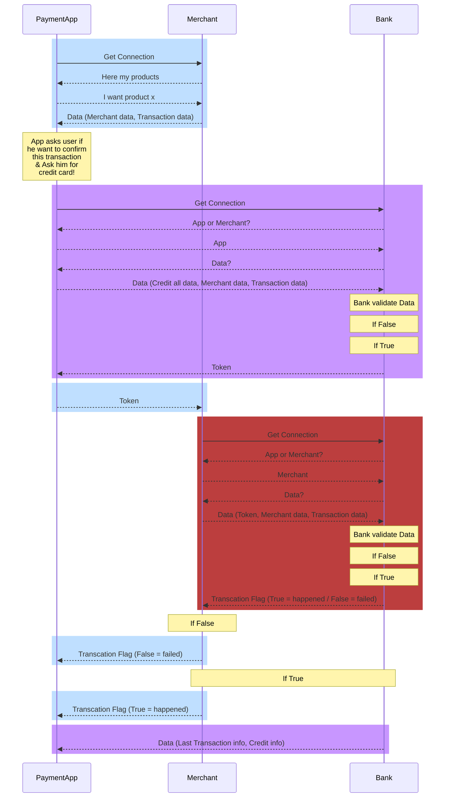

# CreditCard_Tokenization
This project proposes the development of a credit card tokenization system and simulates the cycle of paying with a phone. The system will consist of three programs: End-User Program (e.g. Samsung Pay), Tokenization System (e.g. Bank or Credit Card Provider) and Merchant.

## Sequence Diagram

